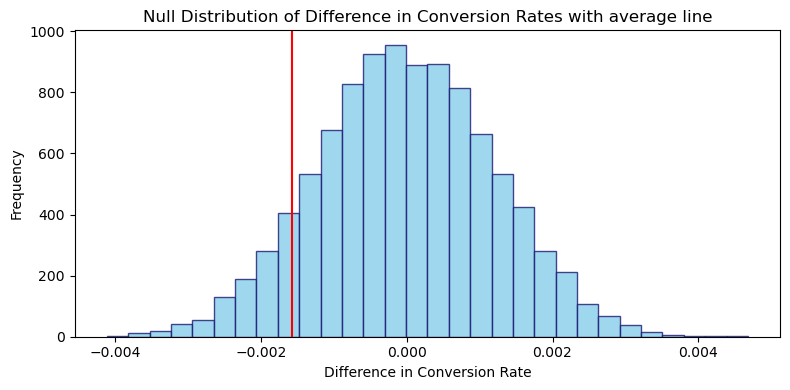

# Website Conversion‑Rate Optimization — A/B Testing Project

> **Goal:** Determine whether a redesigned landing page **significantly increases sign‑ups** compared with the current version, using principled A/B testing and statistical analysis.


## º Method

In order to achieve this, we use the data obtained from `A/B testing` and perform a `z-test` on it to determine if there is a statistically significant improvement due to implementation of the new page.


## 🔎 Key insights:

Based on this result, we should **not launch the new page** at this time, as the data does not support a meaningful improvement in conversion. The following insights can be derived from this analysis:
- **No demonstrable improvement:** No demonstrable increase in conversion was observed and the new landing page **does not outperform** the current version.
- **Goal realignment:** A stronger hypothesis is required for before any implementation is taken into consideration. In absence of strong uplift of conversion trends, user feedback, user retention time and heatmaps can be used to quantify the impact of the current redesign by the UX teams and to serve as guidelines for future changes.
- **Segement sensitivity:** With > 290 k observations, statistical power is high; but sub-segments might hide value improvements. Significant improvements in particular segments can justify controlled rollouts as no drop in conversion suggests the new design is at least non‑harmful.




## 📑 Business Decision

Based on these insights, the following business decisions would be recommended:
- **Park the global rollout** of the current redesign; reiterate the design and testing while keeping the control page live.
- **Drill down by segment** to look for micro‑lifts that may merit targeted deployment.
- **Refine hypotheses** test copy clarity, trust badges, or call‑to‑action placement—changes with historically larger effect sizes.
- **Collect qualitative feedback** to understand why the redesign failed to move the needle via user interviews, heatmaps, user retention time, etc.

## 🗂 Project Structure

| Folder / file | Purpose |
| ------------- | ------- |
| **data/** | Raw and processed CSVs |
| **notebook file** | Jupyter Notebook containing step-by-step flow |
| **assets/** | Final PDF summary and exported figures |
| **requirements.txt** | Python package spec (create venv with `pip install -r requirements.txt`) |


## 📊 Dataset

- Source: Kaggle — **[A/B Testing Results from an E‑commerce Website](https://www.kaggle.com/datasets/zhangluyuan/ab-testing)**  
- Key columns  
  | Column | Description |
  | ------ | ----------- |
  | `user_id` | Unique visitor |
  | `group` | `control` / `treatment` |
  | `landing_page` | Page variant seen |
  | `converted` | 1 if user sign‑up, else 0 |
  | `timestamp` | Visit date‑time |


## ⚙️ Quick‑start

```bash
git clone https://github.com/<your‑handle>/ab-test-conversion-rate-opt.git
cd ab-test-conversion-rate-opt
python -m venv venv && source venv/bin/activate   # or Windows: venv\Scripts\activate
pip install -r requirements.txt
jupyter lab                                        # open notebooks/
